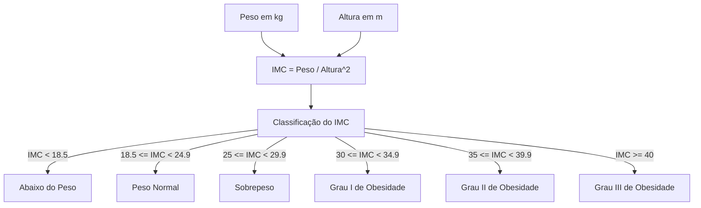
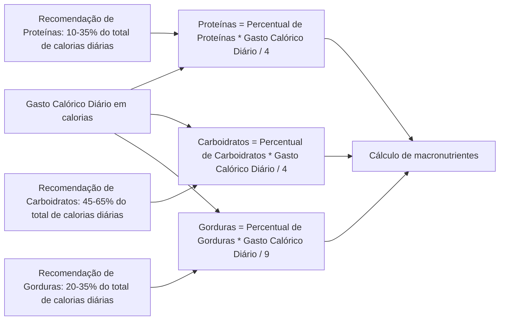

# healthcalc_pack_dotnet2_cgle

## Introdução

O projeto healthcalc_pack_dotnet2_cgle é uma biblioteca .NET que fornece funcionalidades para calcular o Índice de Massa Corporal (IMC) e classificá-lo com base em critérios predefinidos. Além disso, a biblioteca também fornece funcionalidades para calcular a distribuição de macronutrientes com base no objetivo físico selecionado.

## Objetivo

O objetivo do projeto é fornecer uma ferramenta útil para pessoas que desejam monitorar sua saúde e bem-estar. A biblioteca pode ser usada para:

Calcular o IMC e classificar o resultado
Calcular a distribuição de macronutrientes com base no objetivo físico

## Funcionalidades

A biblioteca fornece as seguintes funcionalidades:

1) Cálculo do IMC
2) Classificação do IMC
3) Cálculo da distribuição de macronutrientes

## Diagrama de Cálculo de IMC e Macronutrientes
### Cálculo do IMC

1. **Entradas:**
   - Peso (em quilogramas)
   - Altura (em metros)

2. **Fórmula do IMC:**
   $IMC = \frac{{\text{{Peso}}}}{{\text{{Altura}}^2}}$

3. **Classificação do IMC:**
   - Abaixo do Peso: $IMC < 18.5$
   - Peso Normal: $18.5 \leq IMC < 24.9$
   - Sobrepeso: $25 \leq IMC < 29.9$
   - Obesidade:
     - Grau I: $30 \leq IMC < 34.9$
     - Grau II: $35 \leq IMC < 39.9$
     - Grau III: $IMC \geq 40$

4. **Diagrama Funcional do Cálculo de IMC**

### Cálculo de Macronutrientes

A distribuição de macronutrientes é calculada com base no objetivo físico selecionado. Os seguintes objetivos físicos são suportados:

- Perda de peso: A distribuição de macronutrientes é calculada para maximizar a perda de peso.
- Manutenção de peso: A distribuição de macronutrientes é calculada para manter o peso atual.
- Ganho de peso: A distribuição de macronutrientes é calculada para maximizar o ganho de peso.

1. **Entradas:**
   - Gasto Calórico Diário (em calorias)
   - Distribuição Percentual de Macronutrientes (proteínas, carboidratos, gorduras)

2. **Fórmulas:**
   - Proteínas (em gramas): $Proteínas = \frac{{\text{{Percentual de Proteínas}} \times \text{{Gasto Calórico Diário}}}}{{4}}$

   - Carboidratos (em gramas): $Carboidratos = \frac{{\text{{Percentual de Carboidratos}} \times \text{{Gasto Calórico Diário}}}}{{4}}$

   - Gorduras (em gramas): $Gorduras = \frac{{\text{{Percentual de Gorduras}} \times \text{{Gasto Calórico Diário}}}}{{9}}$

3. **Recomendações Gerais:**
   - Proteínas: 10-35% do total de calorias diárias
   - Carboidratos: 45-65% do total de calorias diárias
   - Gorduras: 20-35% do total de calorias diárias

4. **Diagrama Funcional do Cálculo de Macronutrientes**

## Como usar

Para usar a biblioteca, siga estas etapas:

1) Instale a biblioteca no seu projeto .NET usando o Gerenciador de Pacotes NuGet.

2) Importe o namespace healthcalc_pack_dotnet2_cgle.

3) Crie uma instância das classes IMC ou MacroNutrientes.

4) Use os métodos das classes para calcular o IMC ou a distribuição de macronutrientes.

## Nota Importante

Esta biblioteca é fornecida para fins informativos e não substitui o aconselhamento médico ou nutricional profissional. Antes de fazer mudanças significativas em sua dieta ou estilo de vida, é aconselhável consultar um profissional de saúde qualificado.

## Contribuições

O projeto é open source e aceita contribuições de todos. Se você tiver alguma sugestão ou correção, sinta-se à vontade para enviar um pull request.

## Autores
Esta biblioteca foi desenvolvida por alunos da PUC-Minas como parte de um projeto integrado em Engenharia de Software. Se você tiver dúvidas, comentários ou sugestões, sinta-se à vontade para abrir uma Issue.

- <a href="https://github.com/ClauAlmeida">Claudia Cristina Ribeiro de Almeida</a>
- <a href="https://github.com/eueduardosou">Eduardo Souza Oliveira</a>
- <a href="https://github.com/alvesguilherme7">Guilherme Henrique Silva Alves</a>
- <a href="https://github.com/LucasCVilasBoas">Lucas Cerqueira Vilas Boas</a>

Aproveite o uso do healthcalc_pack_dotnet2_cgle para aprimorar sua jornada de saúde e condicionamento físico!
